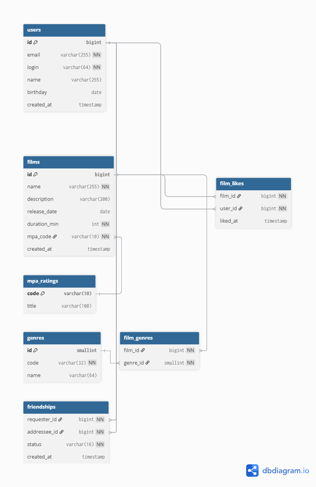

# java-filmorate

Template repository for Filmorate project.

## Схема базы данных



Схема поддерживает хранение фильмов, пользователей, жанров и дружбы:

- **users** — пользователи (email, логин, имя, дата рождения).
- **films** — фильмы (название, описание, дата релиза, продолжительность, рейтинг MPA).
- **mpa_ratings**, **genres** — справочники рейтингов и жанров.
- **film_likes**, **film_genres** — связи многие-ко-многим.
- **friendships** — дружба пользователей со статусом (PENDING, CONFIRMED).

---

## Примеры SQL-запросов

### 1. Получить все фильмы
```sql
SELECT * FROM films;
```

### 2. Топ-10 популярных фильмов
```sql
SELECT f.id, f.name, COUNT(fl.user_id) AS likes
FROM films f
LEFT JOIN film_likes fl ON f.id = fl.film_id
GROUP BY f.id, f.name
ORDER BY likes DESC
LIMIT 10;
```

### 3. Список друзей пользователя
```sql
SELECT u.*
FROM users u
JOIN friendships fs
  ON (
       (fs.requester_id = :user_id AND fs.addressee_id = u.id)
    OR (fs.addressee_id = :user_id AND fs.requester_id = u.id)
     )
WHERE fs.status = 'CONFIRMED';
```

### 4. Общие друзья двух пользователей
```sql
WITH a_friends AS (
  SELECT CASE WHEN requester_id=:userA THEN addressee_id ELSE requester_id END AS friend_id
  FROM friendships
  WHERE status='CONFIRMED' AND :userA IN (requester_id, addressee_id)
),
b_friends AS (
  SELECT CASE WHEN requester_id=:userB THEN addressee_id ELSE requester_id END AS friend_id
  FROM friendships
  WHERE status='CONFIRMED' AND :userB IN (requester_id, addressee_id)
)
SELECT u.*
FROM users u
JOIN a_friends af ON u.id = af.friend_id
JOIN b_friends bf ON u.id = bf.friend_id;
```

### 5. Фильмы по жанру
```sql
SELECT f.*
FROM films f
JOIN film_genres fg ON fg.film_id = f.id
JOIN genres g ON g.id = fg.genre_id
WHERE g.code = 'COMEDY';
```
